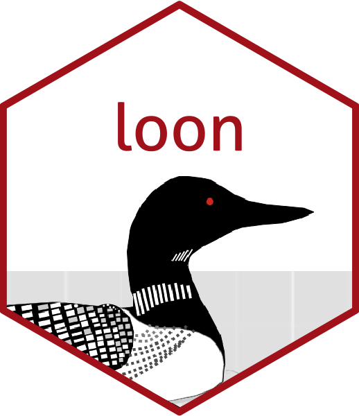
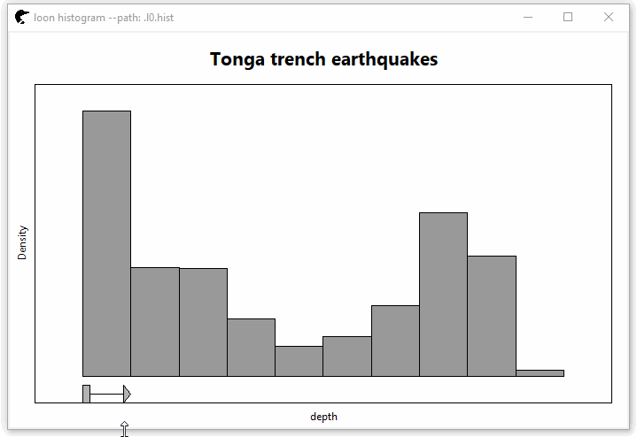
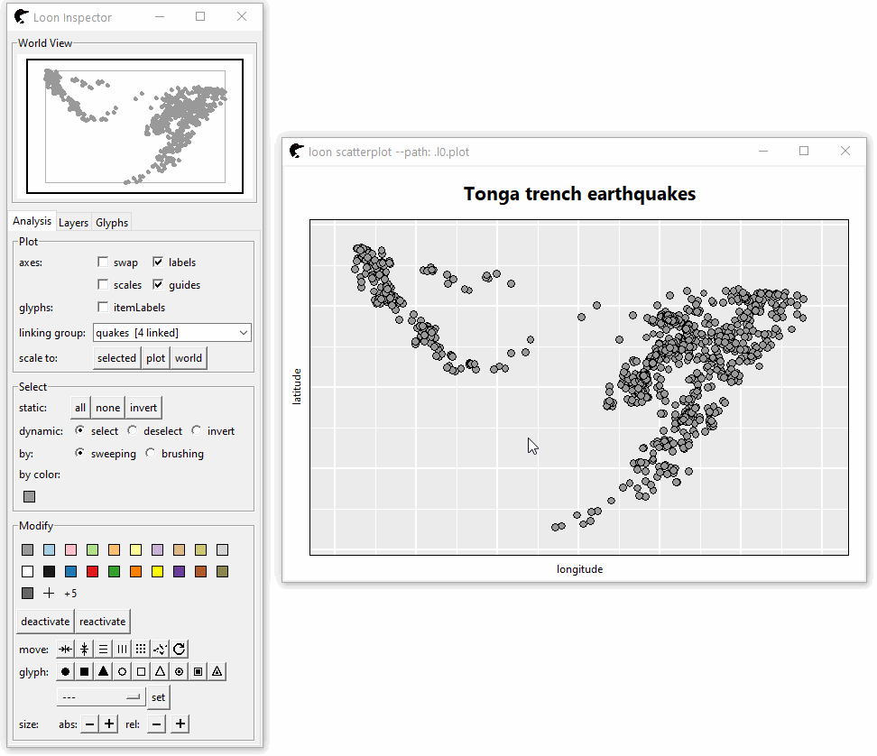
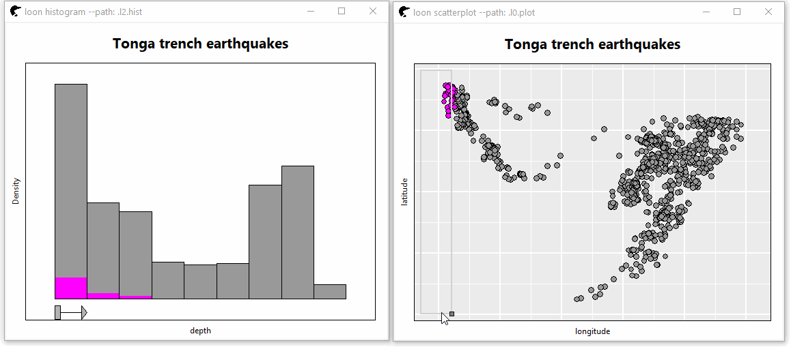
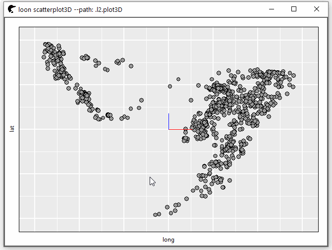
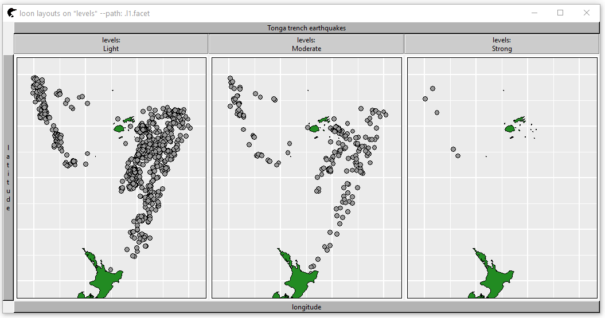

## loon  

[](https://travis-ci.org/great-northern-diver/loon)
[](https://cran.r-project.org/package=loon) 
[](https://cran.r-project.org/package=loon)

loon is an extendible interactive data visualization system designed for exploratory visualization.

Though primarily for exploratory data analysis, it can also be used to develop new interactive analysis and teaching tools. Some sense of the breadth of application and possible extensions can be seen in the various vignettes, demos, and examples in the documentation. 

Some sense of the use of loon can be had from the articles, especially the introduction, available [here](https://great-northern-diver.github.io/loon/articles/introduction.html).


## Web Documentation

In addition to the `R` package documentation we also have both `TCL` and `R` documentation [here](https://great-northern-diver.github.io/loon/l_help/).

Once in R, these are accessible from loon as
```r
# Combined TCL and R documentation (a learning document)
l_help()

# R only manual
l_web()

l_web(directory = "articles")

# R system documentation
help(package = loon")

vignette(package = "loon")

demo(package = "loon")
```


## Installation

The interactive graphics in loon are written on TCL, accessible to R via the tcltk R package.  Be sure to have a version of R that includes Tcl/Tk 8.6.6 (which happens by default but might be missing if you have a custom R build).


```r
# The easiest way to install loon
install.packages("loon")

# You could also install the latest development release directly from GitHub
devtools::install_github("great-northern-diver/loon", subdir = "R")
# Or, to ensure you have the vignettes as well 
# (  also accessible via l_web(directory = "articles")  )
devtools::install_github("great-northern-diver/loon", subdir = "R", 
                         build_opts = c("--no-resave-data") )
```

### Other Usage/Installation notes


- It is best to use loon in **RStudio** or within a terminal.

    - The Rgui app on OSX does not work well with loon.
    
    - The default Windows R GUI will not accept debug messages from Tcl, so for now you need to use RStudio or the terminal.

- Mac users need to install XQuartz

    - Do not close XQuartz while R is running! Otherwise you end up crashing the active R session (including RStudio).


- On Ubuntu one should install the libtk-img debian package (e.g. with sudo apt-get install libtk-img) in order to get a wide variety of export formats with the l_export function.


## Getting started

Once loon is installed, work your way through the introductory vignette:

```r
library(loon)
#
# from the vignette in R
vignette("introduction", package = "loon")
#
# or via the web
l_web(page = "introduction", directory = "articles")
```

### Demos

The data used in this demo is `quakes` giving the locations, depth, Richter magnitude of earthquakes of Fiji since 1964. 

#### Histogram

The binsize can be modified by the graphical element at the bottom of this histogram.

```r
h <- l_hist(quakes$depth,
            yshows = "density",
            showBinHandle = TRUE,
            xlabel = "depth",
            title = "Tonga trench earthquakes",
            linkingGroup = "quakes")
```



#### Scatterplot

Scrolling the mouse to zoom the plot. To pan the plot, press the right mouse button and move the mouse

```r
p <- l_plot(x = quakes$long, y = quakes$lat,
            xlabel = "longitude", ylabel = "latitude",
            linkingGroup = "quakes",
            title = "Tonga trench earthquakes")
```



#### Linking and Brushing

Two plots are linked that the change on one change can affect changes on the other.



#### 3D rotation

```r
with(l_scale3D(quakes),
     l_plot3D(long, lat, depth, linkingGroup = "quakes")
)
```



#### Facetting

The plot is splited into three panels by the level of Richter magnitude.

```r
# add a map layer
NZFijiMap <- maps::map("world2", regions = c("New Zealand", "Fiji"), plot = FALSE)
l_layer(p, NZFijiMap,
        label = "New Zealand and Fiji",
        color = "forestgreen",
        index = "end")
# facet `p`
levels <- rep(NA, nrow(quakes))
levels[quakes$mag < 5 & quakes$mag >= 4] <- "Light"
levels[quakes$mag < 6 & quakes$mag >= 5] <- "Moderate"
levels[quakes$mag >= 6] <- "Strong"
l_facet(p, by = levels, 
        linkingGroup = "quakes")
```



## On the name

The software is named after a large aquatic bird known as the **common loon** (*Gavia immer*) in Canada and the United States, or the **great northern diver** in the United Kingdom.  (Hence the name of the github organization: [https://github.com/great-northern-diver](https://github.com/great-northern-diver)) 

The loon is a visual predator, diving deep beneath the surface, there chasing its prey with speed and remarkable maneuvrability. Once apprehended, the prey
are either swallowed immediately or, when large, at least brought to the surface to be dealt with there. 

This seemed an excellent metaphor for an agile, interactive, and exploratory visualization system; one which empowered an analyst to chase, and perhaps discover, whatever features might be revealed in the data by quickly diving below its surface.  The goal is to provide such a system in loon.

As an acronym "loon" does not fare so well (**l**east **o**bvious **o**stensive **n**ame) and perhaps its synonym "diver" would be better  (**d**irect **i**nteractive **v**isual **e**xploration in **R**).  But, then,  "loon" is funnier ...  **diveR** will be the name of a collection of "loon" related packages.

You can find documentation on some of these related packages via `l_web()`

```r
library(loon)
l_web(package = "loon.data", directory = "reference")
l_web(package = "zenplots")     # become one with your data
l_web(package = "ggmulti")      # high dimensional graphics extending the ggplot2 package
l_web(package = "loon.ggplot")  # interactive grammar of graphics via ggplot2 package
l_web(package = "loon.tourr")   # interactive high dimensional tours via tourr package
# And more coming ..
```

Enjoy!

